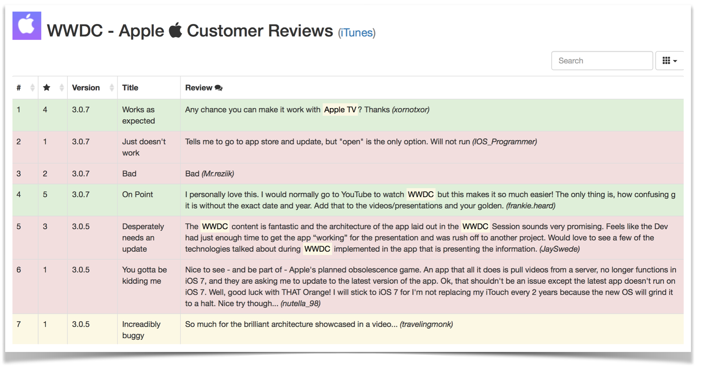

# iOS Customer Review Tools

Simple dashboard and word cloud that uses the Apple RSS feed to display customer reviews.

## Features dashboard

1. Quick overview if the health of your store reviews.
1. Config via JS and/or query string parameters.
1. Supports multiple applications (for example to monitor competitors).
1. Supports multiple app stores (languages).
1. Underline specific indicators.
1. Give the review a (non-)positive background color when it has a minimum number of N stars.
1. Highlight frequent/special reviewers.
1. Search comments and sort based on stars or number.

## Features word cloud

1. Show the top 50 most used words in the review comments.
1. Filter non relevant words that occur often.
1. Use synonyms (e.g: remove / delete) to get a better overview.
1. Different colors for low/mid/high to indicate how often the word is used.
1. Click on the word to get the absolute number.
1. Config via JS and/or query string parameters.
1. Supports multiple applications (for example to monitor competitors).
1. Supports multiple app stores (languages).

## Installation

1. Git clone or [download the repo as a ZIP](https://github.com/martijnhazebroek/iOS-customer-review-dashboard/archive/master.zip).
1. Change/replace the content of js/app/config.js
1. For the tools to work you have to configure the appId(s) in the config.js. To lookup your appId you have to know your bundleId and look for the trackId at [iTunes lookup by bundleId](https://itunes.apple.com/lookup?bundleId={insert_bundle_id_here}). In case you don't know the bundleId you can do a search at [iTunes lookup by name](https://itunes.apple.com/search?media=software&term={insert_app_name_here}).

## Configuration
An example configuration file is included.

    'use strict';

    define(function() {
      return {
        apps: [{
          id: 361285480, // required
          name: 'Keynote', // required
          dashboard: { // optional
            specialUsers: ['Gait uut Almelo'],
            keywords: ['update']
          },
          cloud: { // optional
            irrelevant: ['want'],
            synonyms: {
              downloaden: 'installeren'
            }
          }
        }, {
          id: 640199958,
          language: 'en', // optional
          name: 'WWDC'
        }, {
          id: 376101648,
          name: 'Find my iPhone'
        }],
        defaults: { // optional
          language: 'nl'
        }
      };
    });

## Remarks

Not everything is configurable via the UI (yet?). Examples of the full url's with all query string parameters are:

    file:///your-local-file-sytem-dir/iOS-ratings-dashboard.html?app=keynote&lang=en

    file:///your-local-file-sytem-dir/iOS-ratings-cloud.html?app=WWDC&lang=en

Note: all query params are optional. By default the first app found in the config file will be loaded. An
